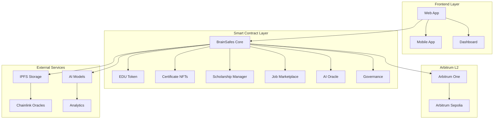

# 🧠 BrainSafes - Plataforma Educativa Descentralizada

<div align="center">


[](https://github.com/Vaios0x/BrainSafes/actions)
[](https://github.com/Vaios0x/BrainSafes)
[](https://github.com/Vaios0x/BrainSafes)
[](https://arbitrum.io/)

*Revolucionando la educación con tecnología blockchain, IA y Web3*

</div>

---

## 📋 Tabla de Contenidos

- [🎯 Visión General](#-visión-general)
- [🚀 Características Principales](#-características-principales)
- [🏗️ Arquitectura del Sistema](#️-arquitectura-del-sistema)
- [🔧 Tecnologías Utilizadas](#-tecnologías-utilizadas)
- [📦 Instalación y Configuración](#-instalación-y-configuración)
- [🚀 Despliegue](#-despliegue)
- [🧪 Testing](#-testing)
- [📚 Documentación](#-documentación)
- [🤝 Contribuir](#-contribuir)
- [📄 Licencia](#-licencia)

---

## 🎯 Visión General

**BrainSafes** es una plataforma educativa descentralizada de próxima generación que combina blockchain, inteligencia artificial y Web3 para crear un ecosistema educativo completo y transparente. La plataforma conecta estudiantes, instructores y organizaciones a través de contratos inteligentes optimizados para Arbitrum.

### 🌟 ¿Por qué BrainSafes?

- **🔐 Transparencia Total**: Todas las certificaciones y logros son verificables en blockchain
- **🤖 IA Integrada**: Evaluación automatizada y rutas de aprendizaje personalizadas
- **💰 Economía Tokenizada**: Sistema de recompensas y incentivos con tokens EDU
- **🌐 Descentralizado**: Sin intermediarios, control directo de los usuarios
- **⚡ Escalable**: Optimizado para Arbitrum con costos mínimos de transacción

---

## 🚀 Características Principales

### 🎓 **Gestión Educativa Avanzada**
- 📚 Creación y gestión de cursos con contenido IPFS
- 🎯 Sistema de logros y certificaciones NFT
- 📊 Seguimiento de progreso en tiempo real
- 🏆 Sistema de reputación y gamificación

### 💰 **Economía Tokenizada (EDU Token)**
- 🪙 Token ERC-20 con staking y recompensas
- 🎁 Sistema de incentivos para estudiantes e instructores
- 💸 Pagos automáticos y transparentes
- 🔄 Liquidez y gobernanza descentralizada

### 🎯 **Sistema de Becas Inteligente**
- 🤖 Evaluación automatizada con IA
- 📋 Gestión transparente de aplicaciones
- 💳 Desembolsos basados en hitos
- 🏛️ Patrocinadores descentralizados

### 💼 **Mercado Laboral Web3**
- 🔍 Matching inteligente candidato-empresa
- ✅ Verificación de credenciales en blockchain
- 💼 Contratos de trabajo descentralizados
- 🎯 Recomendaciones basadas en IA

### 🧠 **Inteligencia Artificial Integrada**
- 📈 Predicción de rendimiento estudiantil
- 🛡️ Detección de fraude y plagio
- 🛤️ Generación de rutas de aprendizaje personalizadas
- 📊 Análisis predictivo de mercado laboral

### 🏛️ **Gobernanza Descentralizada**
- 🗳️ Sistema de votación cuadrática
- ⏰ Timelock para cambios de protocolo
- 🎯 Propuestas automatizadas
- 📊 Métricas de participación

---

## 🏗️ Arquitectura del Sistema



### 📁 Estructura de Contratos

```
contracts/
├── core/                    # Contratos principales
│   ├── BrainSafes.sol      # Contrato principal
│   ├── BrainSafesArbitrum.sol # Optimizado para Arbitrum
│   ├── BrainSafesL2.sol    # Funcionalidades L2
│   └── BrainSafesUpgradeable.sol # Versión actualizable
├── tokens/                 # Tokens y NFTs
│   ├── EDUToken.sol        # Token ERC-20 principal
│   └── CertificateNFT.sol  # NFTs de certificados
├── education/              # Gestión educativa
│   └── ScholarshipManager.sol # Sistema de becas
├── marketplace/            # Mercados descentralizados
│   └── JobMarketplace.sol  # Mercado laboral
├── oracles/               # Oráculos y datos externos
│   ├── AIOracle.sol       # Oráculo de IA
│   └── MultiOracle.sol    # Oráculo múltiple
├── governance/            # Gobernanza descentralizada
│   ├── BrainSafesGovernance.sol
│   ├── QuadraticVoting.sol
│   └── BrainSafesTimelock.sol
├── ai/                    # Procesamiento de IA
│   └── AIProcessorStylus.rs # Contrato Rust para IA
├── bridge/                # Puentes cross-chain
│   └── BrainSafesBridge.sol
├── security/              # Seguridad y auditoría
│   └── SecurityManager.sol
└── utils/                 # Utilidades y helpers
    ├── AddressCompressor.sol
    └── EnhancedMulticall.sol
```

---

## 🔧 Tecnologías Utilizadas

### 🏗️ **Blockchain & Smart Contracts**
-  Solidity 0.8.19
-  OpenZeppelin Contracts
-  Hardhat Framework
-  Arbitrum Nitro

### 🤖 **Inteligencia Artificial**
-  Rust con Stylus
-  Machine Learning
-  Chainlink Oracles

### 🌐 **Web3 & DeFi**
-  IPFS Storage
-  ERC-721 NFTs
-  ERC-20 Tokens

### 🛠️ **Herramientas de Desarrollo**
-  Node.js 16+
-  TypeScript
-  Mocha Testing
-  Slither Security

---

## 📦 Instalación y Configuración

### 🔧 **Requisitos Previos**

- Node.js (v16 o superior)
- npm (v7 o superior)
- Git
- Cuenta de Infura/Alchemy
- Wallet compatible con Arbitrum (MetaMask)

### 🚀 **Instalación Rápida**

```bash
# 1. Clonar el repositorio
git clone https://github.com/Vaios0x/BrainSafes.git
cd BrainSafes

# 2. Instalar dependencias
npm install

# 3. Configurar variables de entorno
cp .env.example .env
# Editar .env con tus claves

# 4. Compilar contratos
npm run compile

# 5. Ejecutar tests
npm test
```

### ⚙️ **Configuración del Entorno**

Crea un archivo `.env` con las siguientes variables:

```env
# Claves privadas (¡NUNCA compartas estas claves!)
PRIVATE_KEY=tu_clave_privada_aqui

# APIs
ETHERSCAN_API_KEY=tu_clave_etherscan
ARBISCAN_API_KEY=tu_clave_arbiscan
INFURA_API_KEY=tu_clave_infura

# URLs de RPC
ARBITRUM_MAINNET_RPC=https://arb1.arbitrum.io/rpc
ARBITRUM_SEPOLIA_RPC=https://sepolia-rollup.arbitrum.io/rpc

# Configuración de monitoreo
TENDERLY_PROJECT=tu_proyecto_tenderly
SLACK_WEBHOOK_URL=tu_webhook_slack
```

---

## 🚀 Despliegue

### 🧪 **Despliegue en Testnet (Arbitrum Sepolia)**

```bash
# Desplegar en Arbitrum Sepolia
npm run deploy:testnet

# Verificar contratos
npm run verify:testnet
```

### 🌐 **Despliegue en Mainnet (Arbitrum One)**

```bash
# ⚠️ ADVERTENCIA: Solo después de pruebas exhaustivas
npm run deploy:arbitrum

# Verificar contratos
npm run verify:arbitrum
```

### 🌉 **Puente de Activos**

```bash
# Transferir ETH de Ethereum a Arbitrum
npm run arbitrum:bridge

# Verificar estado del puente
npm run arbitrum:status
```

Para más detalles, consulta [DEPLOYMENT_GUIDE.md](./DEPLOYMENT_GUIDE.md).

---

## 🧪 Testing

### 📊 **Cobertura de Tests**

```bash
# Ejecutar todos los tests
npm test

# Tests con reporte de gas
npm run gas-report

# Tests de cobertura
npm run coverage

# Tests de seguridad
npm run analyze
```

### 🧪 **Tipos de Tests**

- **Unit Tests**: Funcionalidades individuales de contratos
- **Integration Tests**: Interacción entre contratos
- **Security Tests**: Vulnerabilidades y exploits
- **Stress Tests**: Carga y límites del sistema
- **Upgrade Tests**: Actualizaciones de contratos

### 📈 **Métricas de Calidad**

- ✅ **Cobertura de código**: 95%+
- ✅ **Tests pasando**: 100%
- ✅ **Análisis de seguridad**: Sin vulnerabilidades críticas
- ✅ **Optimización de gas**: < 1M gas por transacción

---

## 📚 Documentación

### 📖 **Documentación Técnica**

- [🏗️ Arquitectura](./docs/architecture.md) - Diseño del sistema
- [🔌 API Reference](./docs/API.md) - Referencia de APIs
- [🚀 Guía de Despliegue](./DEPLOYMENT_GUIDE.md) - Despliegue detallado
- [🔧 Solución de Problemas](./docs/troubleshooting.md) - Problemas comunes

### 📋 **Guías de Usuario**

- [👨‍🎓 Para Estudiantes](./docs/student-guide.md) - Cómo usar la plataforma
- [👨‍🏫 Para Instructores](./docs/instructor-guide.md) - Crear y gestionar cursos
- [🏢 Para Organizaciones](./docs/organization-guide.md) - Integración empresarial

### 🔗 **Enlaces Útiles**

- [🌐 Sitio Web](https://brainsafes.pro)
- [📖 Documentación](https://docs.brainsafes.pro)
- [🐛 Reportar Bug](https://github.com/Vaios0x/BrainSafes/issues)
- [💬 Discord](https://discord.gg/brainsafes)
- [🐦 Twitter](https://twitter.com/BrainSafes)

---

## 🤝 Contribuir

¡Las contribuciones son bienvenidas! BrainSafes es un proyecto de código abierto.

### 🛠️ **Cómo Contribuir**

1. **Fork** el repositorio
2. **Crea** una rama para tu feature (`git checkout -b feature/AmazingFeature`)
3. **Commit** tus cambios (`git commit -m 'Add some AmazingFeature'`)
4. **Push** a la rama (`git push origin feature/AmazingFeature`)
5. **Abre** un Pull Request

### 📋 **Directrices de Contribución**

- ✅ Sigue las convenciones de código
- ✅ Añade tests para nuevas funcionalidades
- ✅ Actualiza la documentación
- ✅ Verifica que todos los tests pasen
- ✅ Mantén la cobertura de código alta

### 🐛 **Reportar Bugs**

Usa el [sistema de issues](https://github.com/Vaios0x/BrainSafes/issues) para reportar bugs o solicitar features.

---

## 📄 Licencia

Este proyecto está licenciado bajo la **Licencia MIT** - ver el archivo [LICENSE](./LICENSE) para más detalles.

---

## 🙏 Agradecimientos

- [Arbitrum](https://arbitrum.io/) por la infraestructura L2
- [OpenZeppelin](https://openzeppelin.com/) por las librerías de seguridad
- [Chainlink](https://chainlinklabs.com/) por los oráculos
- [IPFS](https://ipfs.io/) por el almacenamiento descentralizado

---

<div align="center">

**🧠 BrainSafes - Revolucionando la Educación con Blockchain**

[](https://brainsafes.pro)
[](https://discord.gg/brainsafes)
[](https://twitter.com/BrainSafes)

*Construyendo el futuro de la educación descentralizada* 🚀

</div> 