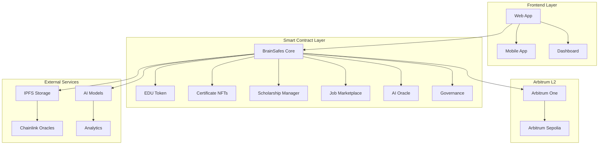

# 🧠 BrainSafes - Decentralized Educational Platform

<div align="center">


[](https://github.com/Vaios0x/BrainSafes/actions)
[](https://github.com/Vaios0x/BrainSafes)
[](https://github.com/Vaios0x/BrainSafes)
[](https://arbitrum.io/)

*Revolutionizing education with blockchain technology, AI, and Web3*

</div>

---

## 📋 Table of Contents

- [🎯 Overview](#-overview)
- [🚀 Key Features](#-key-features)
- [🏗️ System Architecture](#️-system-architecture)
- [🔧 Technologies Used](#-technologies-used)
- [📦 Installation and Setup](#-installation-and-setup)
- [🚀 Deployment](#-deployment)
- [🧪 Testing](#-testing)
- [📚 Documentation](#-documentation)
- [🤝 Contributing](#-contributing)
- [📄 License](#-license)

---

## 🎯 Overview

**BrainSafes** is a next-generation decentralized educational platform that combines blockchain, artificial intelligence, and Web3 to create a complete and transparent educational ecosystem. The platform connects students, instructors, and organizations through smart contracts optimized for Arbitrum.

### 🌟 Why BrainSafes?

- **🔐 Complete Transparency**: All certifications and achievements are verifiable on blockchain
- **🤖 Integrated AI**: Automated evaluation and personalized learning paths
- **💰 Tokenized Economy**: Reward and incentive system with EDU tokens
- **🌐 Decentralized**: No intermediaries, direct user control
- **⚡ Scalable**: Optimized for Arbitrum with minimal transaction costs

---

## 🚀 Key Features

### 🎓 **Advanced Educational Management**
- 📚 Course creation and management with IPFS content
- 🎯 Achievement system and NFT certifications
- 📊 Real-time progress tracking
- 🏆 Reputation system and gamification

### 💰 **Tokenized Economy (EDU Token)**
- 🪙 ERC-20 token with staking and rewards
- 🎁 Incentive system for students and instructors
- 💸 Automatic and transparent payments
- 🔄 Decentralized liquidity and governance

### 🎯 **Intelligent Scholarship System**
- 🤖 AI-powered automated evaluation
- 📋 Transparent application management
- 💳 Milestone-based disbursements
- 🏛️ Decentralized sponsors

### 💼 **Web3 Job Marketplace**
- 🔍 Intelligent candidate-company matching
- ✅ Blockchain credential verification
- 💼 Decentralized employment contracts
- 🎯 AI-powered recommendations

### 🧠 **Integrated Artificial Intelligence**
- 📈 Student performance prediction
- 🛡️ Fraud and plagiarism detection
- 🛤️ Personalized learning path generation
- 📊 Predictive job market analysis

### 🏛️ **Decentralized Governance**
- 🗳️ Quadratic voting system
- ⏰ Timelock for protocol changes
- 🎯 Automated proposals
- 📊 Participation metrics

---

## 🏗️ System Architecture



### 📁 Contract Structure

```
contracts/
├── core/                    # Core contracts
│   ├── BrainSafes.sol      # Main contract
│   ├── BrainSafesArbitrum.sol # Arbitrum optimized
│   ├── BrainSafesL2.sol    # L2 specific features
│   └── BrainSafesUpgradeable.sol # Upgradeable version
├── tokens/                 # Tokens and NFTs
│   ├── EDUToken.sol        # Main ERC-20 token
│   └── CertificateNFT.sol  # Certificate NFTs
├── education/              # Educational management
│   └── ScholarshipManager.sol # Scholarship system
├── marketplace/            # Decentralized markets
│   └── JobMarketplace.sol  # Job marketplace
├── oracles/               # Oracles and external data
│   ├── AIOracle.sol       # AI oracle
│   └── MultiOracle.sol    # Multi oracle
├── governance/            # Decentralized governance
│   ├── BrainSafesGovernance.sol
│   ├── QuadraticVoting.sol
│   └── BrainSafesTimelock.sol
├── ai/                    # AI processing
│   └── AIProcessorStylus.rs # Rust AI contract
├── bridge/                # Cross-chain bridges
│   └── BrainSafesBridge.sol
├── security/              # Security and auditing
│   └── SecurityManager.sol
└── utils/                 # Utilities and helpers
    ├── AddressCompressor.sol
    └── EnhancedMulticall.sol
```

---

## 🔧 Technologies Used

### 🏗️ **Blockchain & Smart Contracts**
-  Solidity 0.8.19
-  OpenZeppelin Contracts
-  Hardhat Framework
-  Arbitrum Nitro

### 🤖 **Artificial Intelligence**
-  Rust with Stylus
-  Machine Learning
-  Chainlink Oracles

### 🌐 **Web3 & DeFi**
-  IPFS Storage
-  ERC-721 NFTs
-  ERC-20 Tokens

### 🛠️ **Development Tools**
-  Node.js 16+
-  TypeScript
-  Mocha Testing
-  Slither Security

---

## 📦 Installation and Setup

### 🔧 **Prerequisites**

- Node.js (v16 or higher)
- npm (v7 or higher)
- Git
- Infura/Alchemy account
- Arbitrum-compatible wallet (MetaMask)

### 🚀 **Quick Installation**

```bash
# 1. Clone the repository
git clone https://github.com/Vaios0x/BrainSafes.git
cd BrainSafes

# 2. Install dependencies
npm install

# 3. Configure environment variables
cp .env.example .env
# Edit .env with your keys

# 4. Compile contracts
npm run compile

# 5. Run tests
npm test
```

### ⚙️ **Environment Configuration**

Create a `.env` file with the following variables:

```env
# Private keys (NEVER share these keys!)
PRIVATE_KEY=your_private_key_here

# APIs
ETHERSCAN_API_KEY=your_etherscan_key
ARBISCAN_API_KEY=your_arbiscan_key
INFURA_API_KEY=your_infura_key

# RPC URLs
ARBITRUM_MAINNET_RPC=https://arb1.arbitrum.io/rpc
ARBITRUM_SEPOLIA_RPC=https://sepolia-rollup.arbitrum.io/rpc

# Monitoring configuration
TENDERLY_PROJECT=your_tenderly_project
SLACK_WEBHOOK_URL=your_slack_webhook
```

---

## 🚀 Deployment

### 🧪 **Testnet Deployment (Arbitrum Sepolia)**

```bash
# Deploy to Arbitrum Sepolia
npm run deploy:testnet

# Verify contracts
npm run verify:testnet
```

### 🌐 **Mainnet Deployment (Arbitrum One)**

```bash
# ⚠️ WARNING: Only after exhaustive testing
npm run deploy:arbitrum

# Verify contracts
npm run verify:arbitrum
```

### 🌉 **Asset Bridging**

```bash
# Transfer ETH from Ethereum to Arbitrum
npm run arbitrum:bridge

# Check bridge status
npm run arbitrum:status
```

For more details, see [DEPLOYMENT_GUIDE.md](./DEPLOYMENT_GUIDE.md).

---

## 🧪 Testing

### 📊 **Test Coverage**

```bash
# Run all tests
npm test

# Tests with gas reporting
npm run gas-report

# Coverage tests
npm run coverage

# Security tests
npm run analyze
```

### 🧪 **Test Types**

- **Unit Tests**: Individual contract functionalities
- **Integration Tests**: Contract interactions
- **Security Tests**: Vulnerabilities and exploits
- **Stress Tests**: Load and system limits
- **Upgrade Tests**: Contract upgrades

### 📈 **Quality Metrics**

- ✅ **Code coverage**: 95%+
- ✅ **Tests passing**: 100%
- ✅ **Security analysis**: No critical vulnerabilities
- ✅ **Gas optimization**: < 1M gas per transaction

---

## 📚 Documentation

### 📖 **Technical Documentation**

- [🏗️ Architecture](./docs/architecture.md) - System design
- [🔌 API Reference](./docs/API.md) - API reference
- [🚀 Deployment Guide](./DEPLOYMENT_GUIDE.md) - Detailed deployment
- [🔧 Troubleshooting](./docs/troubleshooting.md) - Common issues

### 📋 **User Guides**

- [👨‍🎓 For Students](./docs/student-guide.md) - How to use the platform
- [👨‍🏫 For Instructors](./docs/instructor-guide.md) - Create and manage courses
- [🏢 For Organizations](./docs/organization-guide.md) - Business integration

### 🔗 **Useful Links**

- [🌐 Website](https://brainsafes.com)
- [📖 Documentation](https://docs.brainsafes.com)
- [🐛 Report Bug](https://github.com/Vaios0x/BrainSafes/issues)
- [💬 Discord](https://discord.gg/brainsafes)
- [🐦 X](https://x.com/BrainSafes)

---

## 🤝 Contributing

Contributions are welcome! BrainSafes is an open-source project.

### 🛠️ **How to Contribute**

1. **Fork** the repository
2. **Create** a feature branch (`git checkout -b feature/AmazingFeature`)
3. **Commit** your changes (`git commit -m 'Add some AmazingFeature'`)
4. **Push** to the branch (`git push origin feature/AmazingFeature`)
5. **Open** a Pull Request

### 📋 **Contribution Guidelines**

- ✅ Follow code conventions
- ✅ Add tests for new features
- ✅ Update documentation
- ✅ Ensure all tests pass
- ✅ Maintain high code coverage

### 🐛 **Report Bugs**

Use the [issue system](https://github.com/Vaios0x/BrainSafes/issues) to report bugs or request features.

---

## 📄 License

This project is licensed under the **MIT License** - see the [LICENSE](./LICENSE) file for details.

---

## 🙏 Acknowledgments

- [Arbitrum](https://arbitrum.io/) for L2 infrastructure
- [OpenZeppelin](https://openzeppelin.com/) for security libraries
- [Chainlink](https://chainlinklabs.com/) for oracles
- [IPFS](https://ipfs.io/) for decentralized storage

---

<div align="center">

**🧠 BrainSafes - Revolutionizing Education with Blockchain**

[](https://brainsafes.com)
[](https://discord.gg/brainsafes)
[](https://x.com/BrainSafes)

*Building the future of decentralized education* 🚀

</div> 