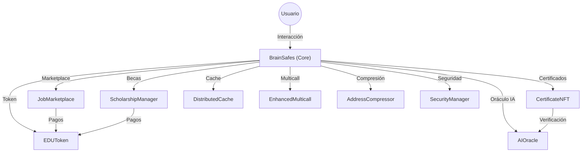

# Arquitectura General de BrainSafes

## Descripción
- **BrainSafes (Core):** Orquesta la lógica principal y coordina los módulos.
- **ScholarshipManager:** Gestión de becas, aplicaciones y pagos.
- **JobMarketplace:** Publicación de empleos, aplicaciones y contratos de trabajo.
- **CertificateNFT:** Emisión y verificación de certificados NFT.
- **EDUToken:** Token ERC20 para pagos, recompensas y staking.
- **AIOracle:** Oráculo de IA para predicciones, recomendaciones y validaciones.
- **DistributedCache:** Cache distribuido para resultados costosos.
- **EnhancedMulticall:** Ejecución de múltiples llamadas en batch.
- **AddressCompressor:** Compresión de direcciones para optimización de gas.
- **SecurityManager:** Gestión de roles y seguridad. 