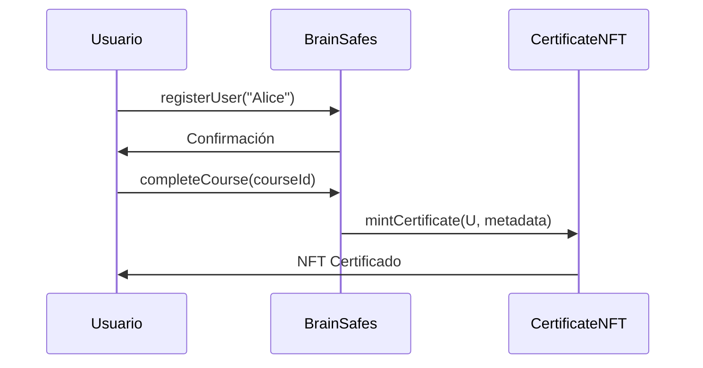
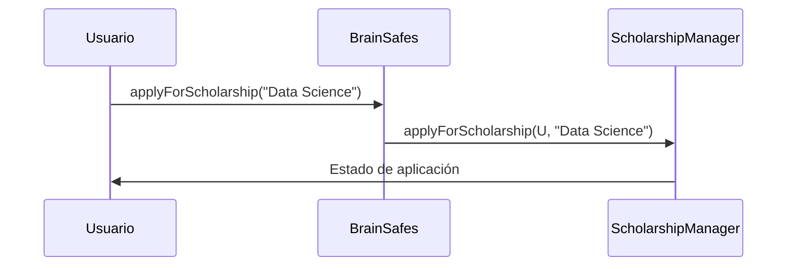
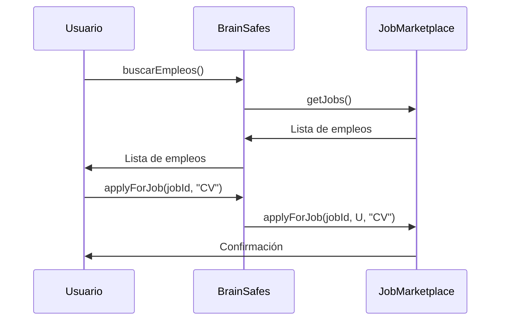

# Flujos Principales de Usuario y Contratos

## Registro y Certificación

```mermaid
sequenceDiagram
  participant U as Usuario
  participant B as BrainSafes
  participant C as CertificateNFT
  U->>B: registerUser("Alice")
  B->>U: Confirmación
  U->>B: completeCourse(courseId)
  B->>C: mintCertificate(U, metadata)
  C->>U: NFT Certificado
```

## Aplicación a Beca

```mermaid
sequenceDiagram
  participant U as Usuario
  participant B as BrainSafes
  participant S as ScholarshipManager
  U->>B: applyForScholarship("Data Science")
  B->>S: applyForScholarship(U, "Data Science")
  S->>U: Estado de aplicación
```

## Marketplace de Empleos

```mermaid
sequenceDiagram
  participant U as Usuario
  participant B as BrainSafes
  participant M as JobMarketplace
  U->>B: buscarEmpleos()
  B->>M: getJobs()
  M->>B: Lista de empleos
  B->>U: Lista de empleos
  U->>B: applyForJob(jobId, "CV")
  B->>M: applyForJob(jobId, U, "CV")
  M->>U: Confirmación
``` 